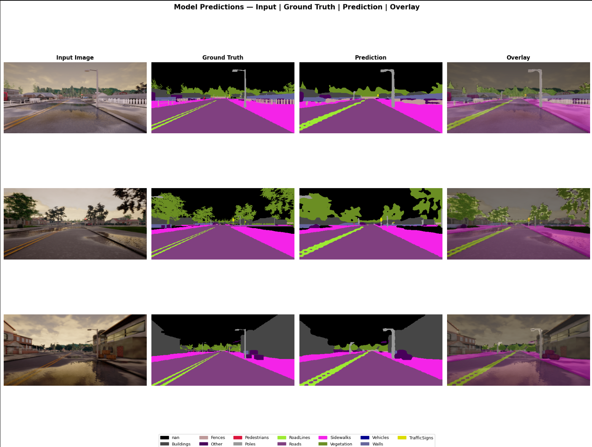

# ROAD · LANE · SIDEWALK SEGMENTATION
### Pixel-Level Scene Understanding for Autonomous Driving Context Awareness

**Team:** Group 06 (E/22/303, E/22/125)
## Team Members

* **R.B.R.M.D. RAJAPAKSHA ** (E/22/303) - [e22303@eng.pdn.ac.lk](mailto:e22303@eng.pdn.ac.lk)
* **D.D.S.K.GUNAWARDHANA** (E/22/125) - [e22125@eng.pdn.ac.lk](mailto:e22125@eng.pdn.ac.lk)

---

## Project Overview
This project implements an end-to-end semantic segmentation pipeline focusing on pixel-level scene understanding for autonomous driving context awareness. The current working method validates the pipeline on a synthetic driving-scene dataset before scaling to full comparison using CamVid, Cityscapes, and BDD100K subsets. 

---

## Qualitative Results

### Dataset Samples: Input (RGB) vs. Ground Truth Mask
<!-- Replace the path below with the actual path to your dataset sample image -->

### Model Predictions — Input | Ground Truth | Prediction | Overlay
<!-- Replace the path below with the actual path to your prediction overlay image -->

---

## Methodology & Pipeline
*   **Data Processing:** Utilizes 20,000 driving frames with RGB and color-coded masks. Masks are decoded to class IDs via a GPU lookup table using a 13-class schema.
*   **Augmentation:** Images are resized to 256x512. Augmentation is handled via Albumentations and includes flip, brightness/contrast adjustments, shift-scale-rotate, and Gaussian noise.
*   **Model Architecture:** The baseline model is DeepLabV3 utilizing a ResNet-50 encoder and ASPP. It contains 42.0M parameters and operates with a batch size of 32 using bfloat16 AMP on a Tesla T4 GPU. The model also leverages mixed precision and `torch.compile`.
*   **Loss & Optimization:** Training utilizes the AdamW optimizer with a OneCycleLR schedule and gradient clipping. To counteract class imbalance, the loss function is a combination of Weighted Cross-Entropy and Dice loss, with weights clipped to [0.1, 20].
*   **Evaluation:** The model is evaluated using per-epoch confusion-matrix mIoU, with qualitative overlays and checkpointing based on the best validation mIoU.

---

## Dataset Details
The dataset consists of synthetic driving scenes covering varied lighting, weather, and road geometry. It is split into 14,000 training frames and 4,000 validation frames, representing a 77.8% / 22.2% split. 

**Class Frequency and Applied Loss Weights**
| Class | Pixel Frequency | Loss Weight |
| :--- | :--- | :--- |
| Roads | 32.1% | 0.10 |
| Vegetation | 11.6% | 0.11 |
| Sidewalks | 9.2% | 0.14 |
| RoadLines | 1.0% | 1.23 |
| Poles | 0.6% | 2.09 |
| TrafficSigns | 0.16% | 7.84 |
| Pedestrians | 0.03% | 20.00 |

---

## Preliminary Results
A full 10-epoch run was completed utilizing early stopping with a patience of 2. 
*   **Best Epoch:** 9 / 10
*   **Best Validation mIoU:** 0.649
*   **Validation Loss at Best Checkpoint:** 0.744

---

## How to Run

The training pipeline is provided as a Jupyter Notebook (`image-proccesing (1).ipynb`). It is optimized to run top-to-bottom on a GPU-enabled Kaggle kernel.

### Prerequisites
Ensure you have a GPU environment (a Tesla T4 or better is recommended) and the following dependencies installed:
*   `torch` (with `torch.amp` support for mixed precision)
*   `torchvision`
*   `albumentations` (for advanced image augmentations)
*   `opencv-python`
*   `numpy`, `pandas`, `matplotlib`, `tqdm`

### Dataset Setup
The notebook expects the CARLA 20K semantic segmentation dataset to be located in the Kaggle input directory structure. 
1. Place the dataset files in your environment.
2. Ensure the `color_dict.csv` file and the `semantic_segmentation_dataset/` folders (`train/images` and `val/images`) are mapped correctly. 
3. If running locally or on Colab, update the `BASE_DIR` variable in the notebook to point to your dataset's root folder.

### Execution
1. Open the notebook in your Jupyter/Kaggle/Colab environment.
2. Ensure the hardware accelerator is set to **GPU**.
3. Run the notebook cells top-to-bottom to initialize the dataset, apply the Albumentations pipeline, build the O(1) GPU mask decoding lookup table, and commence the training loop.

---

## Failure Cases & Observations
*   **Resolution Caps:** Thin lane markings (RoadLines) are under-segmented and fragmented, likely due to the 256x512 input resolution cap.
*   **Rare Class Weakness:** Pedestrians and Vehicles remain unreliable; class weighting cannot fully offset near-zero training exposure.
*   **Boundary Bleed:** The most common confusion in overlay panels is color bleed along the curb line between the sidewalk and road.
*   **Void Dominance:** An unmapped 'nan' class (sky/void) consumes 36% of the pixels. While down-weighted, it still consumes model capacity.
*   **mIoU Plateau:** Validation mIoU gains slowed markedly after epoch 6 (going from 0.62 to 0.65), meaning the current backbone and resolution combination is near its ceiling.

---

## Planned Improvements & Next Steps
*   **Push Baseline:** Raise resolution toward 512x1024 and attempt training with a ResNet-101 backbone.
*   **Weeks 4-6 (Add Architectures):** Implement U-Net and SegFormer (CNN encoder-decoder and transformer baselines) under identical settings.
*   **Weeks 4-6 (Unify Datasets):** Bring CamVid, Cityscapes, and BDD100K subsets onto a shared 4-class schema for cross-model comparison.
*   **Weeks 6-7 (Full Evaluation):** Analyze per-class IoU, Dice (especially for lane markings), pixel accuracy, and conduct a failure-mode analysis across weather, lighting, and occlusion.
*   **Weeks 7-8 (Final Deliverables):** Consolidate visualizations, build cross-model comparison tables, and complete the final report and demo.
