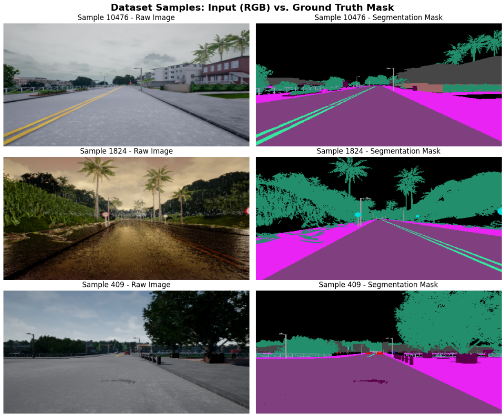

[comment]: # "This is the standard layout for the project, but you can clean this and use your own template"

# Autonomous Driving Context Awareness: Semantic Segmentation

---

<!-- 
This is a sample image, to show how to add images to your page. To learn more options, please refer [this](https://projects.ce.pdn.ac.lk/docs/faq/how-to-add-an-image/)

 -->

## Team
-  e22303, R.B.R.M.D. RAJAPAKSHA , [email](mailto:e22303@eng.pdn.ac.lk)
-  e22125, D.D.S.K.GUNAWARDHANA, [email](mailto:e22125@eng.pdn.ac.lk)

## Table of Contents
1. [Introduction](#introduction)
2. [Qualitative Results](#qualitative-results)
3. [How to Run](#how-to-run)
4. [Methodology & Architecture](#methodology--architecture)
5. [Dataset Details](#dataset-details)
6. [Preliminary Results](#preliminary-results)
7. [Failure Cases & Observations](#failure-cases--observations)
8. [Planned Improvements & Next Steps](#planned-improvements--next-steps)
9. [Links](#links)

---

## Introduction

This project addresses the critical real-world challenge of autonomous driving context awareness. By developing an advanced semantic segmentation pipeline, the system categorizes environmental features in real-time, focusing specifically on roads, lanes, and sidewalks. Utilizing the CARLA dataset, the solution implements optimized deep learning architectures to accurately interpret complex driving scenarios, ultimately contributing to safer and more reliable autonomous navigation systems.

---

## Qualitative Results

### Dataset Samples: Input (RGB) vs. Ground Truth Mask
<!-- Replace the path below with the actual path to your dataset sample image -->

### Model Predictions — Input | Ground Truth | Prediction | Overlay
<!-- Replace the path below with the actual path to your prediction overlay image -->

---

## How to Run

The training pipeline is provided as a Jupyter Notebook (`code.ipynb`). It is optimized to run top-to-bottom on a GPU-enabled Kaggle kernel.

### Prerequisites
Ensure you have a GPU environment (a Tesla T4 or better is recommended) and the following dependencies installed:
*   `torch` (with `torch.amp` support for mixed precision)
*   `torchvision`
*   `albumentations` (for advanced image augmentations)
*   `opencv-python`
*   `numpy`, `pandas`, `matplotlib`, `tqdm`

### Dataset Setup
The notebook expects the CARLA 20K semantic segmentation dataset to be located in the Kaggle input directory structure. 
1. Place the dataset files in your environment.
2. Ensure the `color_dict.csv` file and the `semantic_segmentation_dataset/` folders (`train/images` and `val/images`) are mapped correctly. 
3. If running locally or on Colab, update the `BASE_DIR` variable in the notebook to point to your dataset's root folder.

### Execution
1. Open the notebook in your Jupyter/Kaggle/Colab environment.
2. Ensure the hardware accelerator is set to **GPU**.
3. Run the notebook cells top-to-bottom to initialize the dataset, apply the Albumentations pipeline, build the O(1) GPU mask decoding lookup table, and commence the training loop.

---

## Methodology & Architecture

This section details the machine learning pipeline, including:
*   **Data Processing:** Utilizes 20,000 driving frames with RGB and color-coded masks. Masks are decoded to class IDs via a GPU lookup table using a 13-class schema.
*   **Loss Optimization:** Integration of Weighted Cross-Entropy and Dice loss functions to handle imbalanced classes, with weights clipped to [0.1, 20].
*   **Data Augmentation:** Images are resized to 256x512. Implementation of environmental shifts, scaling, rotations, and Gaussian noise via Albumentations to improve model generalization.
*   **Mask Decoding:** Utilization of an O(1) GPU lookup table for highly efficient data processing.
*   **Model Architecture:** The baseline model is DeepLabV3 utilizing a ResNet-50 encoder and ASPP. It contains 42.0M parameters and operates with a batch size of 32 using bfloat16 AMP on a Tesla T4 GPU. The model also leverages mixed precision and `torch.compile`.
*   **Evaluation:** The model is evaluated using per-epoch confusion-matrix mIoU, with qualitative overlays and checkpointing based on the best validation mIoU.

---

## Dataset Details
The dataset consists of synthetic driving scenes covering varied lighting, weather, and road geometry. It is split into 14,000 training frames and 4,000 validation frames, representing a 77.8% / 22.2% split. 

**Class Frequency and Applied Loss Weights**

| Class | Pixel Frequency | Loss Weight |
| :--- | :--- | :--- |
| Roads | 32.1% | 0.10 |
| Vegetation | 11.6% | 0.11 |
| Sidewalks | 9.2% | 0.14 |
| RoadLines | 1.0% | 1.23 |
| Poles | 0.6% | 2.09 |
| TrafficSigns | 0.16% | 7.84 |
| Pedestrians | 0.03% | 20.00 |

---

## Preliminary Results
A full 10-epoch run was completed utilizing early stopping with a patience of 2. 
*   **Best Epoch:** 9 / 10
*   **Best Validation mIoU:** 0.649
*   **Validation Loss at Best Checkpoint:** 0.744

---

## Failure Cases & Observations
*   **Resolution Caps:** Thin lane markings (RoadLines) are under-segmented and fragmented, likely due to the 256x512 input resolution cap.
*   **Rare Class Weakness:** Pedestrians and Vehicles remain unreliable; class weighting cannot fully offset near-zero training exposure.
*   **Boundary Bleed:** The most common confusion in overlay panels is color bleed along the curb line between the sidewalk and road.
*   **Void Dominance:** An unmapped 'nan' class (sky/void) consumes 36% of the pixels. While down-weighted, it still consumes model capacity.
*   **mIoU Plateau:** Validation mIoU gains slowed markedly after epoch 6 (going from 0.62 to 0.65), meaning the current backbone and resolution combination is near its ceiling.

## Links

- [Project Repository](https://github.com/cepdnaclk/{{ page.repository-name }}){:target="_blank"}
- [Project Page](https://cepdnaclk.github.io/{{ page.repository-name}}){:target="_blank"}
- [Department of Computer Engineering](http://www.ce.pdn.ac.lk/)
- [University of Peradeniya](https://eng.pdn.ac.lk/)

[//]: # (Please refer this to learn more about Markdown syntax)
[//]: # (https://github.com/adam-p/markdown-here/wiki/Markdown-Cheatsheet)
